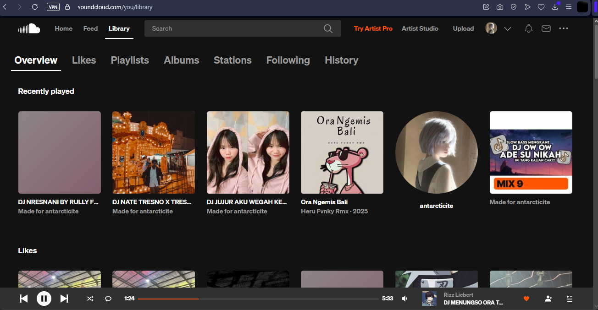

# SoundCloud UI Slicing
Tugas Slicing Website menggunakan Plain HTML, CSS, dan JavaScript DOM. 

# Teknologi & Fitur
- HTML5: Struktur semantik (header, nav, main, footer).
- Plain CSS: Sistem layouting menggunakan CSS Grid dan Flexbox (tanpa framework).
- Responsive Design: Mendukung penyesuaian tampilan untuk perangkat mobile, tablet, dan desktop menggunakan Media Queries.
- Vanilla JavaScript: Manipulasi DOM dinamis untuk merender array objek menjadi elemen kartu lagu.

yang di-slicing page Library -> Overview

# Screenshot
